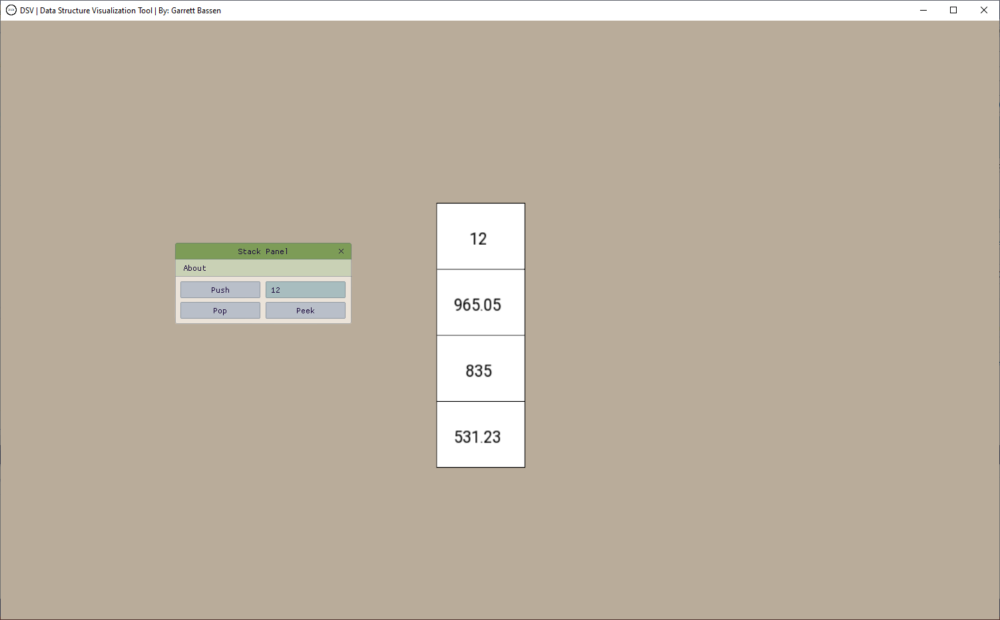

# DSVis — Data Structure Visualizer

DSV allows for visualization of data structures for the learning environment. The interactive tools allows for a greater understanding of data structures and faster learning.

## Install

**This tool is currently only officially supported on windows OS**
All code should be cross compatible but install instructions are not provided for linux of macOS

**ATTENTION:**
INSTALL INSTRUCTIONS ARE TARGETED TOWARDS VISUAL STUDIO. INSTALL SCRIPT WILL WORK REGARDLESS, ALTHOUGH ADDITIONAL LINKING WILL NEED DONE IF YOU DO NOT USE THE SOLUTION FILE

Install Instructions:
1. Download or clone
2. Run `setup.bat`
3. Open DSV/libraries/imgui/imgui_h
4. Go to line 52 under `#pragma once`
5. Type `#include "imgui-SFML.h"`
6. Ensure architecture is set for x64
7. Run Program
